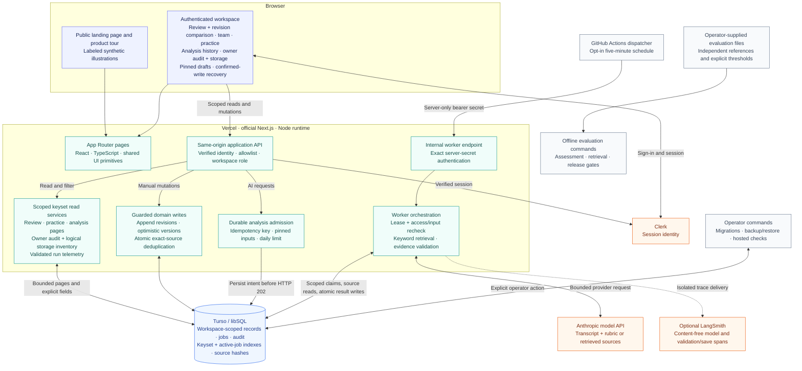
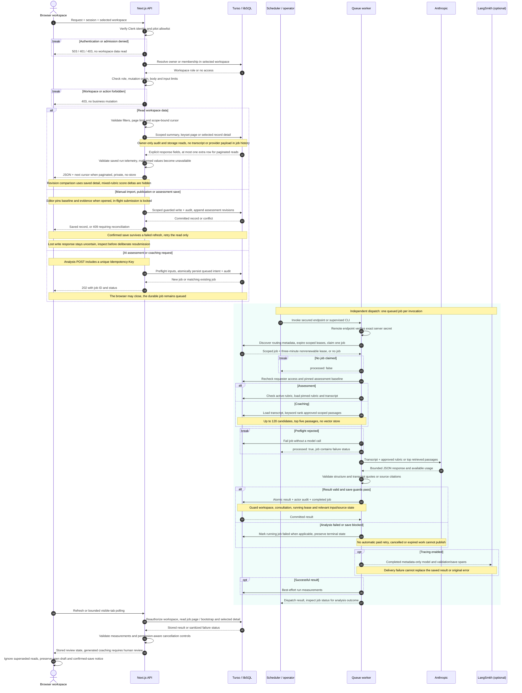

# ConsultIQ architecture

This document describes the implemented TypeScript application, including revision comparison, draft recovery, owner audit history and the current storage/query changes. It is the canonical architecture reference; [IMPLEMENTATION.md](IMPLEMENTATION.md) maps the API and code boundaries. The diagrams are also available as editable Mermaid files: [overall architecture](diagrams/overall-architecture.mmd) and [query and response flow](diagrams/query-response.mmd). Portable rendered previews: [overall architecture SVG](diagrams/overall-architecture.svg) and [query/response SVG](diagrams/query-response.svg).

The application targets official Next.js on Vercel, Clerk identity and Turso/libSQL storage. A deployed public page is not evidence that the authenticated workspace or worker has passed live acceptance. Clerk/Turso setup, migration application, provider credentials and authenticated hosted checks remain deployment gates. [Operations readiness](OPERATIONS_READINESS.md) records the checks and their limits.

The SVG previews are rendered with Mermaid CLI 12.0.0 and [the checked-in render configuration](diagrams/render-config.json). Keep each Markdown Mermaid block identical to its `.mmd` source and regenerate the matching SVG after a diagram change.

## Overall architecture

Solid arrows carry application requests or data. The dotted arrow is optional telemetry whose delivery is isolated from business success. The worker shown inside Vercel runs only when dispatched; it is not a continuously running server. An alternative supervised `npm run worker` process calls the same queue implementation outside Vercel.

| Boundary | What crosses it | Enforcement |
| --- | --- | --- |
| Browser → application API | Session, selected workspace, validated user input | Verified Clerk identity, deployment allowlist, workspace membership, role and mutation-origin checks |
| Application → database | Parameterized, workspace-scoped SQL | Repository scope, foreign keys, guarded writes and atomic batches |
| Dispatcher → worker endpoint | Server-only bearer secret; no workspace selector | Exact secret check before opening storage; separate from Clerk sessions |
| Worker → model provider | Selected transcript and approved rubric or retrieved sources | Explicit server-side configuration, bounded requests and responses, no automatic paid retry |
| Worker → LangSmith | Job ID, configured model, stage timing and allowlisted error codes | Empty trace inputs/outputs, bounded delivery, no raw exceptions or consultation content |
| Operator → database | Explicit migration, backup or staging-restore commands | Credentials stay outside source control; workspace backup and empty-target restore checks |
| Evaluation files → CLI | Operator-supplied cases, independent references and thresholds | Deterministic validation and aggregate reports; no provider calls or production-data reads |

Clerk supplies identity; application code supplies workspace authorization. The selected `X-Workspace-Id` header is a request to access a workspace, never proof of membership. `sessionStorage` holds only the selected workspace ID. Consultation records, invitation tokens and credentials are not stored there.

## Query and response flow

### Request admission and ordinary queries

`server/runtime.ts` verifies session admission before opening the database. `server/handler.ts` then resolves the selected workspace, applies owner/reviewer/viewer permissions, checks mutation origins and validates request bodies. Application responses use `Cache-Control: private, no-store`; a shared response cache cannot leak a workspace payload.

The initial workspace response contains lightweight conversation/document summaries and job metadata with active runs prioritized. Full transcripts, assessment history and document text load when opened. Review queues, reviewer worklists, the practice inbox, eligible follow-up selection, analysis history and owner audit history use bounded server queries rather than filtering only the bootstrap list. Scope-bound keyset cursors preserve the selected filters; they do not bypass authorization or freeze a database snapshot.

| Read path | Returned data | Resource and access boundary |
| --- | --- | --- |
| Workspace bootstrap | Up to 200 consultation summaries, up to 200 job summaries, approved-document summaries and current rubric | Active/recent job ID selection precedes the bounded final sort and measurement projection; transcript history is loaded separately |
| Analysis history | Filtered job page, consultation title, validated measurements and `can_cancel` | Default 25/max 50 rows; workspace/filter-bound cursor; no transcript, generation input or request-key fields; cancellation still checks permission on the server |
| Owner audit history | Event ID, action, entity ID, actor ID and timestamp | Default 25/max 50 rows; exact action filter and workspace/action-bound cursor; owner authorization on every request; no record-content joins |
| Consultation detail | Transcript, saved assessment revisions and recent generated coaching | Workspace-scoped on demand; revision comparison runs against these saved assessments, not a new model request |
| Owner storage inventory | Consistent row counts and logical UTF-8 text bytes by table/group | Scoped aggregate when requested; it scans stored values and is not a physical-storage or billing measurement |

The client pins an open assessment draft to its original revision, retains its saved citations, ignores superseded detail responses, and separates confirmed writes from failed refreshes. Revision comparison uses saved records and suppresses numeric differences across rubric versions or unsupported scores. After a confirmed import, rubric publication or assessment save, a failed refresh offers a read retry without repeating the mutation. A lost write response remains uncertain and requires inspection before deliberate resubmission. These drafts live in memory and do not survive a browser reload. Malformed run measurements become unavailable values instead of blocking the workspace. See [review and operational recovery](REVIEW_OPERATIONS_ITERATION.md) for these boundaries.

Workspace Settings exposes `GET /api/audit-events` to the owner alongside queue operations and storage. It pages metadata events without loading the referenced records, so deletion does not erase the recorded event and a missing actor is shown as “Not recorded.” This is an operational history of emitted application events, not a comprehensive compliance audit, a read-access log or a tamper-evident ledger. Refresh failures retain the current page with an error; changing the action filter does not relabel stale results as a new page.

Manual assessment edits append revisions. A client supplies the assessment it edited; the save checks the latest revision atomically. A conflicting save returns 409 instead of overwriting another review. Assignment edits use their own version guards, and practice completion pins the reviewed baseline and follow-up assessments.

### Asynchronous analysis and recovery

The public Next.js API always uses queued analysis. A successful admission writes the job and audit record before returning HTTP 202. That response confirms durable admission, not successful analysis. A matching idempotency key returns the original job; reusing it for another operation returns 409. The browser generates a new key for each deliberate request and does not automatically retry uncertain writes.

The dispatcher claims at most one queued job per invocation. Its only cross-workspace reads discover routing metadata; the claim, lease expiry updates, payload reads and result writes carry the recorded workspace. Before invoking the provider it checks the requester's current admission/membership, the queued baseline and, for scoring, the rubric. Coaching retrieves currently approved sources at execution time; source passages are not snapshotted into the queued payload.

Scoring validates every numeric score against a quote in the cited transcript turn. Unsupported dimensions become unscored; structurally invalid responses are rejected. Coaching requires a retrieved chunk ID and a matching source quote for each citation. Citation validation establishes source identity and text, not the correctness of every coaching claim. Human review remains required.

Successful AI result insertion, its actor-attributed audit record and the completed job status commit together. Save guards reject a cancelled/expired job, a removed consultation, a stale scoring baseline or removed coaching sources. Cancellation does not guarantee aborting an already transmitted provider request or reversing its charge. The queue never automatically repeats a paid model call and does not promise exactly-once provider execution.

Running leases expire after three minutes and are recovered on a later dispatch. If no dispatcher runs, queued work stays queued and expired leases remain until dispatch resumes. The checked-in GitHub Actions schedule is five minutes and is controlled by `CONSULTIQ_WORKER_ENABLED`; its hosted enablement and credentials must be verified separately. The UI polls visible tabs every five seconds for a bounded 24-attempt cycle, then exposes manual refresh. Neither this schedule nor the UI polling cadence is a latency SLA.

A worker HTTP 200 means the dispatch was handled: a claimed job can still have failed. Workspace Operations reports job aggregates, not an independent worker heartbeat. [Product reliability](PRODUCT_RELIABILITY.md) describes the scheduler, lease, cancellation and revocation boundaries in detail.

### Failure contract

| Response or state | Meaning | Recovery |
| --- | --- | --- |
| 401 | Missing application session, or invalid worker secret on the worker endpoint | Sign in, or fix the server-side dispatcher credential |
| 403 | Pilot admission, workspace membership, role or mutation-origin check failed | Restore intended access; do not retry under a different workspace ID |
| 404 | Record not found in the authorized workspace | Refresh the relevant list; do not infer another workspace's records |
| 409 | Stale revision, changed task/approval, changed queued input, conflicting request key, or duplicate source | Refresh and reconcile against current state before a deliberate new submission |
| 422 | Invalid input, missing approved rubric, no retrieved context, or unsupported coaching | Correct the input or provide approved material; preserve manual review |
| 429 | An active analysis already exists for the call, or the workspace daily admission limit is reached | Inspect job history and limits before another request |
| 502 during analysis | Provider transport, status, envelope or bounded-response failure | Inspect the failed job; any new paid run is a deliberate user action |
| 503 | Missing authentication/storage/provider configuration or unavailable infrastructure | Complete configuration or restore the service; missing configuration fails closed |
| Queued → failed/interrupted | Worker lease expired without a successful commit | Investigate the worker and provider outcome before deliberately requesting a new run |
| Lost mutation response | The write may already have committed | Refresh and inspect saved state before resubmitting |
| Confirmed mutation followed by failed refresh | The write is saved but the current read failed | Retain the saved acknowledgement and retry the read; do not repeat the import, publication or assessment save |
| Malformed persisted run measurements | The job remains readable but its metrics are unavailable | Show unavailable metrics; do not infer zero duration/tokens or fail the whole workspace |

Provider errors and other worker-time failures normally appear in stored job history after a 202 response; they are not retroactively returned on the admission request. A malformed enabled LangSmith endpoint fails before provider invocation. Trace delivery failures after analysis preserve the original result or error, use no raw error content and never trigger analysis retries. Retrieval and trace delivery are outside the saved analysis timing interval.

## Storage and query design

| Data group | Tables | Persistence policy |
| --- | --- | --- |
| Workspace access | `workspaces`, `workspace_members`, `workspace_invitations` | Verified owner/member access; invitations store expiring hashes, not reusable plaintext tokens |
| Review evidence | `consultations`, `rubrics`, `assessments` | Immutable imported turns, immutable rubric versions and appended assessment revisions |
| Retrieval and coaching | `knowledge_documents`, `knowledge_chunks`, `coaching_runs`, `coaching_reviews` | Approved document text, derived chunks, checked citations and appended human decisions |
| Team follow-through | `review_tasks`, `review_task_events`, `practice_assignments`, `practice_completions` | Versioned reviewer handoffs and pinned human-reviewed comparisons |
| Operations | `analysis_jobs`, `audit_events` | Durable execution intent, sanitized results/measurements and actor-attributed events |

JSON is used for bounded transcript turns, rubric definitions, validated assessment dimensions, citations and job metadata. Relational IDs, workspace scope, timestamps and statuses remain queryable columns. There is no vector store, Redis cache or external message broker in this implementation.

The current storage/query improvements are intentionally incremental:

- **Exact source deduplication:** new approved documents store a SHA-256 hash of the trimmed document body, unique within a workspace. A legacy exact-body check also covers existing documents without a hash. A duplicate produces a 409 without extra chunks or a successful-import audit. Existing documents are not deleted, rewritten or silently merged. Similar-but-different sources remain separate.
- **Query-specific indexes:** migration `0006_gray_polaris.sql` supports workspace traversal, follow-up eligibility, retrieval candidates, practice listing and job dispatch. Migration `0007_sharp_menace.sql` replaces the earlier workspace/time job and audit indexes with workspace/time/ID indexes that match stable page ordering, and adds a partial index containing only queued/running jobs. It leaves records intact and avoids keeping redundant prefix indexes. Latest-assessment lookups retain their existing call/created-time index. Indexes add write/storage cost; local query plans are not a hosted latency benchmark.
- **Bounded job bootstrap:** indexed active and recent terminal branches select at most 200 narrow job IDs in total before primary-key detail lookups, the final priority sort and telemetry projection. The active-first response remains capped at 200; the separate history endpoint exposes older runs. If active runs fill the response, the terminal branch has a zero limit. This removes the whole-history priority sort rather than hiding it behind a small response limit. Job and audit continuation queries compare the `(created_at, id)` tuple so their matching indexes can seek into later pages. Equal-time bootstrap jobs now use descending ID order to match analysis history; assessment/rubric revision ordering is unchanged.
- **Metadata-only audit browsing:** owner audit pages read explicit columns directly from `audit_events`. Filtering and continuation stay in SQL, and a one-row lookahead determines whether another page exists without an all-history count or content joins. Events retain their IDs and actor metadata after a referenced consultation or source is deleted.
- **Owner storage inspection:** `GET /api/storage` returns a consistent scoped aggregate of row counts and UTF-8 logical text bytes, split by data group/table. It returns neither record contents nor cross-workspace totals. This is an application payload estimate, not physical database allocation, index size, backups, replicas, provider billing or a quota.
- **Whole-workspace follow-up candidates:** `GET /api/practice/:id/candidates` pages consultations whose latest assessment is human across the workspace, restricted to the assignment's coordinator, rubric and chronological requirements. Search no longer depends on the latest 200 bootstrap summaries. Completion revalidates current state before saving.

These changes do not eliminate all large-workspace costs. Optional status, kind, title or audit-action filters can still scan within scoped index ranges; not every filter combination has a dedicated index. Substring library search still scans scoped text candidates and ranks at most 120 candidates into five passages. Full assessment history loads on consultation detail. Storage inventories scan text values, and counts/page reads can observe concurrent changes. Source text and derived chunks intentionally coexist to preserve source inspection and stable citation IDs. Retention automation, physical-space reclamation and large hosted load tests remain future work. [The architecture/query iteration report](ARCHITECTURE_QUERY_ITERATION.md) records the new query-plan measurements, index tradeoffs and owner rollout work; [the earlier optimization report](STORAGE_QUERY_OPTIMIZATION.md) covers migration 0006.

Deletion is explicit and owner-controlled: removing a consultation cascades its assessments, jobs and dependent workflow records. Removing a knowledge document removes its chunks and clears saved coaching content in that workspace to avoid retaining copied passages. Metadata-only audit records remain. No background retention deletion has been added.

Migrations are generated from `db/schema.ts` and applied explicitly with `npm run db:migrate`; builds and HTTP requests do not migrate production. Apply all pending migrations before serving the updated application. Backups preserve workspace records in a consistent snapshot, omit invitation credentials and restore only into a separately configured empty migrated staging database. See [Operations readiness](OPERATIONS_READINESS.md) before a recovery drill.

## What this architecture does not claim

- No Python service, model training pipeline, acceptance prediction or clinically validated scoring exists in the current runtime.
- No live audio, speech-to-text, turn detection, patient-record connector, native CRM/calendar synchronization or semantic/vector retrieval is implemented.
- LangSmith tracing is optional and content-free; it is not a token-cost ledger, automatic evaluation dataset or customer activity audit.
- Offline assessment/retrieval/release-gate tools exist, but model quality requires independent references, an approved rubric and explicit acceptance thresholds. Passing code tests is not an evaluated domain benchmark.
- Public deployment, configured credentials, worker operation, authenticated hosted acceptance and commercial readiness are separate checks. The diagrams describe implemented boundaries; they do not certify those checks as completed.
