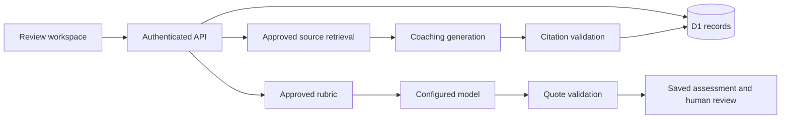

# Implementation

## Request and data flow

The React application calls same-origin API routes. The server receives the authenticated Sites identity, resolves its private workspace, and scopes repository operations to that workspace. D1 stores records; data does not depend on browser local storage.

## Code boundaries

| Location | Responsibility |
| --- | --- |
| `app/page.tsx`, `app/marketing.css` | Product landing page |
| `app/workspace/` | Persistent review, library, rubric and settings interfaces |
| `components/ui/` | Shared shadcn/Base UI primitives |
| `lib/product.ts` | Domain types, transcript/rubric validation, CSV export |
| `lib/evidence.ts`, `lib/assessment.ts` | Deterministic quote checks and supported-score rules |
| `server/handler.ts` | HTTP authentication, origin checks, body limits and routing |
| `server/repository.ts` | Workspace-scoped persistence and state transitions |
| `server/ai.ts` | Assessment, RAG and optional tracing |
| `server/model.ts` | Configured provider HTTP adapter, bounded response reads and sanitized failures |
| `lib/evaluation.ts`, `scripts/evaluate.mjs` | Offline aggregate comparison against independent reference scores |
| `db/schema.ts`, `drizzle/` | Database definition and generated migration history |
| `tests/` | Domain and API tests against real SQLite migrations |

## Assessment invariants

Imported transcript turns are immutable. An evidence span must occur in the referenced turn after limited typography and whitespace normalization. Semantic similarity is not used to pass a quote. A dimension without valid supporting evidence is stored with a null score. Coverage remains visible, and the overview only averages complete assessments.

Every assessment stores its rubric version, author kind, prompt version and model where relevant. Human corrections append a revision. An atomic latest-assessment check rejects stale saves, including a model result that finishes after a newer review. Publishing a rubric creates a new version and does not rewrite earlier assessments.

## Retrieval and coaching

Adding an approved text document creates scoped chunks. Search uses normalized keywords and ranks matching passages. Coaching supplies the selected transcript and retrieved passages to the configured model. Every returned citation must identify a retrieved chunk and contain a quote found in that chunk. Unsupported answers are rejected instead of stored. At persistence time, one atomic statement checks that the consultation and every retrieved source still exist in the workspace. Deletion during generation returns a conflict and does not recreate removed source content or emit a successful-save audit event.

This validates citation identity and text, not the semantic correctness of every sentence. Generated coaching remains marked for human review. Deleting a library document removes its chunks and clears saved coaching answers in that workspace to avoid retaining copied passages from removed material. Deleting a consultation cascades to its assessments, coaching and jobs. Metadata-only audit events remain.

## API

All application endpoints require authenticated identity. Mutation requests reject cross-origin browser writes. Responses are not cached.

| Method | Path | Operation |
| --- | --- | --- |
| GET / PATCH | `/api/workspace` | Read workspace / rename |
| POST | `/api/consultations` | Import transcript |
| GET / PATCH / DELETE | `/api/consultations/:id` | Read / update recorded outcome / delete |
| POST | `/api/consultations/:id/reviews` | Append human assessment |
| POST | `/api/consultations/:id/score` | Run configured model assessment |
| POST | `/api/consultations/:id/coaching` | Generate supported coaching |
| POST | `/api/rubrics` | Publish approved version |
| POST | `/api/library` | Add approved document |
| GET | `/api/library/search?q=` | Retrieve approved passages |
| DELETE | `/api/library/:id` | Remove document and dependent coaching content |

## Identity and operation limits

The trusted identity header is supplied by the Sites dispatcher. Do not expose this Worker directly behind an arbitrary host that accepts caller-supplied identity headers. A deployment outside Sites needs an equivalent verified authentication boundary before serving the API.

Workspaces are private to individual platform users. This is not organization membership or a team permission system. The host's owner-only site policy adds another access boundary for the current private publication.

Analysis runs during the HTTP request. A job record captures running, completed, failed and interrupted state; daily limits and duplicate-running checks constrain provider use. There is no durable queue, retry scheduler or token-cost ledger. Library and loaded-consultation limits are intentional pilot constraints, not a scaling claim.

## Observability

Optional LangSmith instrumentation wraps assessment and coaching runs. Traces include run name, job ID, model, timing and errors; input/output content is hidden in the client before upload. Trace delivery is flushed before the request finishes. This release does not provide nested retrieval/model/validation spans, token cost accounting, evaluation datasets or automatic feedback synchronization. Application job history remains available without LangSmith.

The instrumentation uses LangSmith's [custom tracing](https://docs.langchain.com/langsmith/annotate-code) and [input/output masking](https://docs.langchain.com/langsmith/mask-inputs-outputs). Masking trace payloads does not stop the model provider receiving transcript and source content needed for generation.

## Offline assessment evaluation

The evaluator calls the same assessment preparation and quote validation used by the application. It compares validated scores with supplied reference scores, reports numeric agreement only on mutually scored dimensions, and reports support/abstention disagreements separately. Missing numeric denominators produce null metrics. CLI reports include version metadata and an input hash but omit per-case identifiers, transcript text, quotes and coaching content. See [Evaluation](EVALUATION.md). This is evaluation infrastructure, not a completed domain benchmark.

## Provider response handling

The provider adapter reads response chunks under a byte limit instead of buffering an arbitrary response before checking its length. Failed HTTP response bodies are cancelled without exposing their content. Network failures, incomplete body streams and malformed or truncated model envelopes produce sanitized errors. Requests retain the configured timeout; no automatic paid retry was added.
