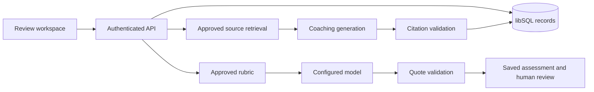

# Implementation

## Request and data flow

The React application calls same-origin API routes. The Next.js Node runtime verifies a Clerk session and checks an explicit user-ID allowlist, resolves its private workspace, and scopes repository operations to that workspace. Hosted libSQL stores records; data does not depend on browser local storage.

## Code boundaries

| Location | Responsibility |
| --- | --- |
| `app/page.tsx`, `app/marketing.css` | Product landing page |
| `app/workspace/` | Persistent review, library, rubric and settings interfaces |
| `components/ui/` | Shared shadcn/Base UI primitives |
| `lib/product.ts` | Domain types, transcript/rubric validation, CSV export |
| `lib/evidence.ts`, `lib/assessment.ts` | Deterministic quote checks and supported-score rules |
| `server/handler.ts` | HTTP authentication, origin checks, body limits and routing |
| `server/repository.ts` | Workspace-scoped persistence and state transitions |
| `server/ai.ts` | Assessment and RAG orchestration |
| `server/observability.ts` | Content-free nested tracing and isolated trace delivery |
| `server/model.ts` | Configured provider HTTP adapter, bounded response reads and sanitized failures |
| `lib/evaluation.ts`, `scripts/evaluate.mjs` | Offline aggregate comparison against independent reference scores |
| `db/schema.ts`, `drizzle/` | Database definition and generated migration history |
| `tests/` | Domain and API tests against real SQLite migrations |

## Assessment invariants

Imported transcript turns are immutable. An evidence span must occur in the referenced turn after limited typography and whitespace normalization. Semantic similarity is not used to pass a quote. A dimension without valid supporting evidence is stored with a null score. Coverage remains visible, and the overview only averages complete assessments.

Every assessment stores its rubric version, author kind, prompt version and model where relevant. Human corrections append a revision. An atomic latest-assessment check rejects stale saves, including a model result that finishes after a newer review. Publishing a rubric creates a new version and does not rewrite earlier assessments.

## Retrieval and coaching

Adding an approved text document creates scoped chunks. Search uses normalized keywords and ranks matching passages. Coaching supplies the selected transcript and retrieved passages to the configured model. Every returned citation must identify a retrieved chunk and contain a quote found in that chunk. Unsupported answers are rejected instead of stored. At persistence time, one atomic statement checks that the consultation and every retrieved source still exist in the workspace. Deletion during generation returns a conflict and does not recreate removed source content or emit a successful-save audit event.

This validates citation identity and text, not the semantic correctness of every sentence. Generated coaching remains marked for human review. Deleting a library document removes its chunks and clears saved coaching answers in that workspace to avoid retaining copied passages from removed material. Deleting a consultation cascades to its assessments, coaching and jobs. Metadata-only audit events remain.

## API

All application endpoints require authenticated identity. Mutation requests reject cross-origin browser writes. Responses are not cached.

| Method | Path | Operation |
| --- | --- | --- |
| GET / PATCH | `/api/workspace` | Read workspace / rename |
| POST | `/api/consultations` | Import transcript |
| GET / PATCH / DELETE | `/api/consultations/:id` | Read / update recorded outcome / delete |
| POST | `/api/consultations/:id/reviews` | Append human assessment |
| POST | `/api/consultations/:id/score` | Run configured model assessment |
| POST | `/api/consultations/:id/coaching` | Generate supported coaching |
| POST | `/api/rubrics` | Publish approved version |
| POST | `/api/library` | Add approved document |
| GET | `/api/library/search?q=` | Retrieve approved passages |
| DELETE | `/api/library/:id` | Remove document and dependent coaching content |

## Identity and operation limits

`server/session.ts` verifies the Clerk session; `server/access.ts` applies CONSULTIQ_ALLOWED_USER_IDS. Missing configuration denies access. The API passes the verified ID directly to the handler; caller-supplied Sites identity headers are ignored. `server/database.ts` provides atomic libSQL batches and checks foreign keys. Vercel refuses local file storage. Migrations run explicitly, never on a request or build.

Personal workspaces support owner-managed reviewer/viewer memberships, actor-bound invitations and revocation. Selected workspace IDs are resolved against verified identity on every request. The pilot allowlist remains an additional admission boundary. Vercel preview Deployment Protection supplies an additional host boundary; production domain privacy must be verified separately before promotion.

Hosted analysis requests now persist a queued intent and return 202. A separate privileged worker claims jobs, checks pinned inputs and requester permissions, and runs generation under a nonrenewable lease. Daily limits and duplicate-running checks constrain provider use. There is no automatic paid retry or token-cost ledger. Library and loaded-consultation limits are intentional pilot constraints, not a scaling claim.

## Observability

Optional LangSmith instrumentation records assessment and coaching runs with nested `model_response` and `validation_save` stages. Traces carry job ID, configured model, timings and allowlisted failure codes. Inputs and outputs are empty; raw exception messages and stacks are never passed to the trace client. Completed spans are delivered after the analysis callback, with a bounded wait. Delivery failure does not replace the saved result or the original analysis error, and never retries the analysis. Invalid trace endpoint configuration still fails before model invocation.

Retrieval remains outside the admitted analysis interval and is not traced by this increment. Token counts remain in application job history; this integration does not provide LangSmith token/cost accounting, evaluation datasets or automatic feedback synchronization. Application job history remains available without LangSmith.

The instrumentation uses LangSmith's [custom tracing](https://docs.langchain.com/langsmith/annotate-code) and [input/output masking](https://docs.langchain.com/langsmith/mask-inputs-outputs). Masking trace payloads does not stop the model provider receiving transcript and source content needed for generation.

## Offline assessment evaluation

The evaluator calls the same assessment preparation and quote validation used by the application. It compares validated scores with supplied reference scores, reports numeric agreement only on mutually scored dimensions, and reports support/abstention disagreements separately. Missing numeric denominators produce null metrics. CLI reports include version metadata and an input hash but omit per-case identifiers, transcript text, quotes and coaching content. See [Evaluation](EVALUATION.md). This is evaluation infrastructure, not a completed domain benchmark.

## Provider response handling

The provider adapter reads response chunks under a byte limit instead of buffering an arbitrary response before checking its length. Failed HTTP response bodies are cancelled without exposing their content. Network failures, incomplete body streams and malformed or truncated model envelopes produce sanitized errors. Requests retain the configured timeout; no automatic paid retry was added.

## Persisted analysis measurements

Analysis jobs now have nullable, versioned measurement data: total analysis duration, model-adapter duration, validation/save duration and provider-reported uncached input/output token counts. The workspace settings display these values for recent runs. Missing values remain null, including old jobs and failures before usage is reported. Timings exclude preflight/source retrieval, trace flushing and the optional telemetry update. These are not full-request latency or a billing ledger. See [Run measurements](RUN_MEASUREMENTS.md) for boundaries and migration requirements.

## Interrupted attempt protection

AI result insertion checks the matching job ID, workspace, consultation, operation and running status atomically with the insert. Human reviews require no job. Final job updates only affect running rows, so a late completion cannot overwrite interrupted state. Queued-worker lease recovery happens on dispatch. The legacy direct orchestration test path also supports stale recovery during admission. Result persistence, successful-save audit and job completion now share a transaction; the queue stores durable execution intent but cannot guarantee exactly-once execution at the provider. See [the handoff](PROJECT_HANDOFF.md).

Successful AI persistence now commits the result, audit event and completed job status in one transaction. The validation/save timing includes this transaction. Optional telemetry is saved afterward; storage failure can leave measurements unavailable without failing the saved result.

## Reviewed coaching and practice

`server/learning.ts` implements workspace-scoped append-only coaching decisions, practice assignments and immutable follow-up completions. Mutations deduplicate request IDs, reject stale inputs atomically and commit success audits in the same transaction. Joined reads return pinned baseline/follow-up assessments. See [Learning workflow](LEARNING_WORKFLOW.md) for schema, API, deletion rules and limits.

## Runtime recovery and setup checks

`server/runtime.ts` owns verified session admission, connection lifecycle and sanitized infrastructure failures. The runtime opens storage only after authorization, and a close failure cannot mask a committed response. `app/workspace/error.tsx` provides retry navigation for rendering failures without exposing raw errors. `npm run doctor` checks required setup and migration checksums without querying workspace records; it is an operator tool, not an HTTP endpoint. See [Deployment reliability](DEPLOYMENT_RELIABILITY.md) for boundaries and unfinished work.

## Team, queue and operations boundaries

`server/team.ts` resolves membership and enforces roles. `server/queue.ts` handles idempotent admission, atomic claims, cancellation and lease recovery. `server/worker-auth.ts` protects remote dispatch; the worker never accepts a caller-selected workspace. `server/operations.ts` returns owner-only workspace aggregates. Retrieval uses shared `lib/retrieval.ts` ranking. New persistence is migrations 0003 and 0004. Read [PRODUCT_RELIABILITY.md](PRODUCT_RELIABILITY.md) for deployment requirements and limits.
